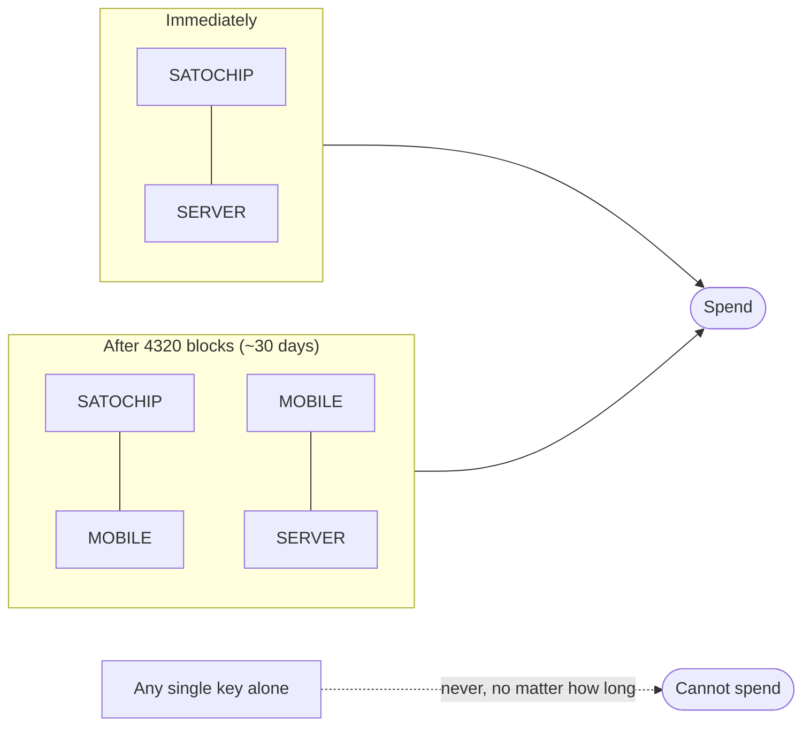
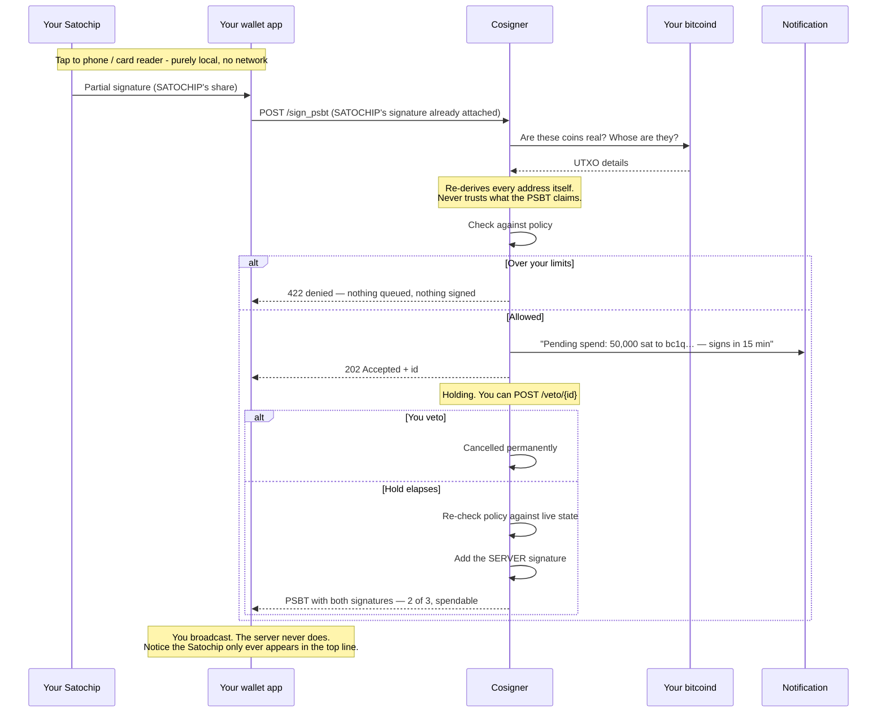
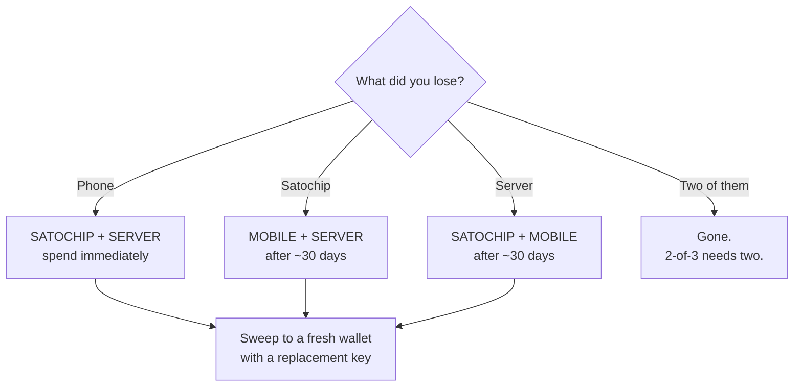
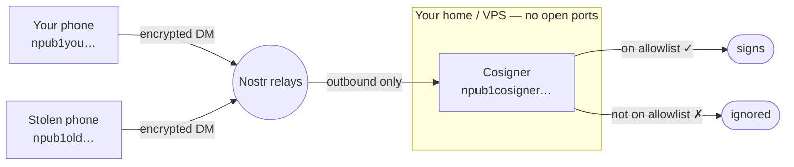

# Bitme Cosigner

A self-hosted, policy-gated Bitcoin co-signing service. It holds one key in a 3-key wallet and
countersigns transactions only when your rules allow — it can never spend alone, never starts a
transaction, and never broadcasts one.

Think of it as the third signer in a 2-of-3 wallet, except it's *your* server, running *your*
rules, and you can read every line of it.

> **Status: signet only.** The service refuses to run on mainnet unless you explicitly opt in,
> and you shouldn't opt in until you've run the whole thing end to end. See
> [Current status](#current-status) for exactly what is and isn't finished.

---

## Contents

- [The idea](#the-idea)
- [The wallet](#the-wallet)
- [How a spend actually works](#how-a-spend-actually-works)
- [Recovery: losing a device](#recovery-losing-a-device)
- [Where Nostr fits](#where-nostr-fits)
- [How it compares to Bitkey](#how-it-compares-to-bitkey)
- [HTTP API](#http-api)
- [Running it](#running-it)
- [Threat model](#threat-model)
- [Current status](#current-status)

---

## The idea

A single-key wallet has an obvious problem: one compromised device, one lost phone, one bad
moment, and the money is gone. Multisig fixes that but introduces a new one — now you're
juggling several keys and there's still nothing watching *what* gets signed.

Bitme adds a third signer that is a **policy engine**: it knows your spending limits, it tells
you out loud before it signs anything, and it gives you a window to say no. Because that signer
is a key in the wallet rather than an app in front of it, its rules can't be clicked past.

Three properties hold no matter what:

1. **The server can never spend on its own.** Not with a bug, not if it's rooted, not ever. It's
   one key of the two required.
2. **If the server disappears forever, your money doesn't.** There are two recovery paths that
   don't involve it at all.
3. **The server can't initiate anything.** It only ever adds a signature to a transaction
   someone else built.

These are enforced by Bitcoin consensus, not by this code being correct. There are
[machine-checked proofs](bitme-cosigner/src/invariants.rs) of each one, run on every build.

---

## The wallet

Three keys:

| Key | Lives on | You use it via |
|---|---|---|
| **SATOCHIP** | A smartcard in your pocket | Tap to a phone / card reader |
| **MOBILE** | Bitcoin Keeper on your phone | The app |
| **SERVER** | This service, on your own box | Automatically, under policy |

The rule is: **any two of the three can spend, but anything involving the phone key waits 30
days.**



Which gives exactly three ways to move money:

| Combination | When | What it's for |
|---|---|---|
| SATOCHIP + SERVER | Immediately | **Everyday spending.** The only path the server co-signs on demand, and the only one that's policy-gated. |
| SATOCHIP + MOBILE | After ~30 days | **The server died.** Your VPS burned down, or you shut it off. You don't need it. |
| MOBILE + SERVER | After ~30 days | **The Satochip died.** Lost, snapped, demagnetised. |

The descriptor:

```
wsh(thresh(2,pk(SATOCHIP),s:pk(SERVER),snj:and_v(v:pk(MOBILE),older(4320))))
```

**Why the timelock is on the phone key.** It keeps the policy engine meaningful: the only way
to spend without satisfying a 30-day-deep timelock is SATOCHIP + SERVER, so there's no routing
around your own rules for day-to-day spending.

⚠️ **Read this carefully — it is the most misunderstood part of the design.** `older(N)` is a
*relative* timelock (BIP68). It requires **that coin to be 4320 blocks deep**, not that 30 days
pass from now. Coins you received last week are locked out of the recovery paths; coins that
have been sitting for six months satisfy it **already, right now**.

So for a mature wallet, the recovery paths are open immediately, and the timelock is *not* a
30-day alarm window. What actually protects mature coins on the no-hardware path is the
server-side hold, the notification, and your veto — which is why `[recovery] hold_seconds`
defaults to 48 hours rather than minutes, and why an offline destination whitelist is worth
setting.

**Why 30 days.** It's baked into your addresses, so it's a hard floor on how long a *fresh
deposit* stays unrecoverable, and changing it later means moving your coins. Long enough to
matter; short enough that recovery isn't a season of your life.

> **An earlier version of this design was wrong** and it's worth saying so. It required the
> SATOCHIP for *both* paths, which meant losing that one card — with no seed backup — lost the
> funds permanently. That's a single point of catastrophic failure. The shape above fixes it:
> every single-device loss is survivable. There's a test named
> [`every_pair_can_eventually_spend`](bitme-cosigner/src/invariants.rs) that fails the build if that ever
> stops being true.

---

## How a spend actually works

**The Satochip never talks to the server. It has no networking - no WiFi, no Bluetooth, nothing
that reaches the internet.** It only ever talks to whatever taps it: your phone over NFC, or a
card reader plugged into a computer. Every "SATOCHIP + SERVER" spend is really two separate,
disconnected steps stitched together by a PSBT file that your wallet app carries between them -
never a live connection between the card and this service.

The server never signs the moment you ask, either way. It queues, it tells you, it waits, and
only then does it sign - so a signature is never the first you hear about a transaction.



The cosigner never talks to the Satochip either — as far as this service is concerned, "SATOCHIP
signed" just means *a PSBT arrived with a valid signature under SATOCHIP's key already in it*. It
has no way to reach the card, ask it to sign, or know it exists except through that signature.
Your wallet app (Bitcoin Keeper, or Sparrow with a card reader) is the only thing that talks to
both sides — locally to the Satochip, over the network to the cosigner — and a PSBT file is the
only thing that ever crosses between them.

Some specifics that matter:

- **It re-derives everything.** A PSBT is untrusted input. Amounts, addresses, and which outputs
  are really your change all get checked against your own node — a transaction that *claims* an
  output is change gets rejected if the address doesn't actually derive from your wallet.
- **Policy is checked twice**, once when you submit and again the instant before signing. Two
  transactions submitted together can't both slip under one shared limit; the second gets denied
  at signing time when the first has already consumed the budget.
- **Killing the server doesn't cancel a pending spend.** The queue is on disk. Restart it and
  anything whose hold has elapsed gets signed. To stop something, veto it.
- **Signing is atomic with recording.** The spend is written to the ledger in the same database
  transaction as the signature, so a crash can't produce a signature nobody counted.

Policy knobs: per-transaction cap, rolling daily/weekly/monthly caps, max fee, max fee rate,
optional destination whitelist. Over the line is a hard refusal — there is no override.

Changing those rules requires a signature from your **Satochip** (standard Bitcoin signed
message), is versioned, and rejects replays of old authorisations. A compromised server can't
quietly raise its own limits.

---

## Recovery: losing a device

**The unavoidable part first.** You cannot revoke a key from coins that already exist — the key
is baked into the address. Replacing a device means *building a new wallet and moving your coins
to it*. Bitkey works exactly this way too; every one of their recoveries mints a new key set and
sweeps on-chain. Anyone claiming otherwise is selling something.

So there are two different questions, and it's worth keeping them apart:

**"Can I still get my money?"** — yes, from any two keys:



**"Can I stop the lost device from working?"** — only by sweeping. Until the coins move, the old
key still signs. What the server can do is refuse to co-sign anything except your escape
transaction while you get organised.

### Back these up

Losing a *seed* is much worse than losing a *device* — a device is replaceable from its seed.
You need:

1. **Satochip seed** — written down, or on a SeedKeeper card.
2. **Mobile seed** — Bitcoin Keeper's backup.
3. **Server xprv** — this one's on you; the service never generates keys.
4. **The descriptor itself.** ⚠️ Easy to forget and fatal to lose. In a multisig, all three keys
   plus no descriptor equals no money — you can't reconstruct the script. It lives in your
   `wallet.toml`; if that's only on the VPS, one dead server and you're locked out despite
   holding everything.

Bitkey solves #4 with an encrypted descriptor backup on their servers, and #3-equivalent with an
"Emergency Exit Kit" PDF in your cloud storage. Ours is a **recovery kit** — `wallet.toml` plus the
SERVER xprv, `age`-encrypted with a passphrase:

```sh
cosigner recovery-kit export --config wallet.toml --passphrase-file pass.txt --out kit.age
cosigner recovery-kit import --in kit.age --passphrase-file pass.txt \
  --out-config restored.toml --out-server-key restored.xprv
```

Store `kit.age` somewhere other than the box it came from — a second machine, a paper/QR backup,
or Nostr relays (below). It backs up the *box*, not the keys: Satochip and Mobile already have
their own seed backups, so this has nothing to add there.

---

## Where Nostr fits

Nostr is **not** a key here, and it never will be. Nostr keys live in browser extensions and get
pasted between apps; making one a spending key would hand your money to whoever compromises your
social identity. Its job is **addressing and transport**. Two uses, both real:

### 1. Talking to the cosigner without exposing it

**Built.** Reaching the service over HTTP means an open port — on a home box that's
port-forwarding, a domain, a certificate.

Instead, `[nostr_transport]` gives the cosigner its own Nostr identity, connecting **outward**
to relays and receiving requests as NIP-17 gift-wrapped private messages (`{"method", "path",
"body"}`, mirroring the HTTP API one-to-one). Each message is dispatched straight into the same
`axum::Router` the HTTP server itself runs — the same policy, signing, and freeze logic, just a
different door — so the two transports can never drift apart. It's the same pattern NIP-46
already uses for remote Nostr signing, applied to Bitcoin PSBTs.



What that buys:

- **No inbound ports.** Nothing exposed, no forwarding, no certificate, no dynamic DNS.
- **Authentication for free.** Every message is signed by its sender. Only npubs on your
  allowlist get processed — the signature *is* the auth.
- **Revocation that actually works.** Each device is an npub. Remove it from the allowlist and
  it's mute immediately. This is the clean answer to *"how do I stop a stolen phone talking to
  my server?"* — far better than a bearer token you'd have to rotate everywhere.
- **Reachable from anywhere** without a VPN or publishing your home IP.

### 2. Storing the recovery kit

**Built.** An encrypted recovery kit needs to survive losing your house. The usual answer is
iCloud or Google Drive — which is an account that can be SIM-swapped, locked, or closed, and a
company that can be compelled.

```sh
cosigner recovery-kit publish --in kit.age --passphrase-file pass.txt \
  --relay wss://relay.damus.io --relay wss://nos.lol --relay wss://relay.snort.social
cosigner recovery-kit fetch --passphrase-file pass.txt \
  --relay wss://relay.damus.io --relay wss://nos.lol --out kit.age
```

Publishing the (already `age`-encrypted) blob to a handful of independent relays instead: no
account to hijack, nothing to ask permission from, replicated across operators who don't know
each other. It's still just ciphertext — useless without the passphrase.

The identity used to publish/locate it is derived deterministically *from that same passphrase*
(NIP-78 application data, kind 30078) — one secret to remember, not a passphrase plus a separate
Nostr key to also back up. Relay URLs are always yours to choose; nothing is hardcoded.

**Tradeoffs, honestly:** you depend on relays being reachable (use several — pick at least 3),
and relays can see *that* this identity published something and roughly how large it is, even
though the content itself stays opaque.

---

## How it compares to Bitkey

Block's [Bitkey](https://bitkey.world) is the most mature product in this shape, and it's open
source, so it's worth being precise rather than hand-wavy. The findings below are read from
[their repository](https://github.com/proto-at-block/bitkey), not their marketing.

| | Bitkey | Bitme |
|---|---|---|
| Structure | `wsh(sortedmulti(2, app, hardware, server))` | `wsh(thresh(2, satochip, server, mobile+timelock))` |
| Third key held by | Block, in an AWS Nitro enclave | You, on your own box |
| Everyday spend | app + hardware (server not involved) | satochip + server (**always** policy-gated) |
| Spending limits | Server policy — Block chooses to refuse | Server policy — you choose to refuse |
| Recovery delay | **7 days, enforced by their server** | **~30 days, enforced by Bitcoin** |
| Recovery without the company | Emergency Exit Kit + hardware | Any two of your three keys |
| Lose two keys | Unrecoverable | Unrecoverable |
| Social recovery | Yes — up to 3 contacts, threshold 1 | Not built |

**The difference that matters most** is that line about the delay. Bitkey's waiting period, its
spending limits, and its whole recovery flow are server-side policy: bypassable if their server
is compromised, and simply *gone* if it disappears. The only thing Bitcoin enforces for them is
the 2-of-3 itself.

Ours puts the delay in the script. `older(4320)` is a consensus rule — it holds if this service
is rooted, seized, or deleted. That's not a claim about our code being better; it's a structural
difference in where the guarantee lives.

**Where they're clearly ahead:** setup is dramatically easier, they have social recovery and
inheritance, their hardware is attested against a factory root, and they notify you repeatedly
during a delay window rather than once. Adopting that last one is on the list below — one missed
notification shouldn't silently burn your veto window.

**One thing worth knowing about their social recovery:** the threshold is 1, and a recovery
contact colluding with Block could reconstruct enough to spend. Not a knock — just the shape of
the tradeoff, and a reason we haven't rushed to copy it.

---

## HTTP API

| Endpoint | Method | Purpose |
|---|---|---|
| `/health` | GET | Status, network, current policy version |
| `/inspect` | POST | Parse a transaction — amounts, destinations, fee, which path |
| `/sign_psbt` | POST | Submit for signing; returns an id to poll or veto |
| `/sign_psbt/{id}` | GET | Status of a queued spend |
| `/veto/{id}` | POST | Cancel before it signs |
| `/policy` | GET | Current rules and version |
| `/policy` | POST | Change the rules (needs a Satochip signature) |
| `/freeze` | GET/POST | Stop all co-signing. **POST is unauthenticated on purpose** — it's the "my phone was just stolen" button and must work in a hurry. Freezing can only cause denial of service; that's strictly better than theft. |
| `/unfreeze` | POST | Resume. Needs a Satochip signature, or the `cosigner unfreeze` CLI if the Satochip is what you lost. |

No web UI, by design. Everything is API.

---

## Running it

- **[docs/DOCKER.md](docs/DOCKER.md)** — Docker Compose, for a Mac or a VPS.
- **[docs/UMBREL.md](docs/UMBREL.md)** — installing on Umbrel via a community app store.

Quick look without installing anything (the crate lives in `bitme-cosigner/`, not the repo root —
see [Development](#development) below for why):

```sh
cd bitme-cosigner
cargo run -- descriptor build --config ../examples/signet-demo.toml
```

That prints the descriptor, some addresses, and the full invariant report — no node, no server,
no keys of your own required.

Setting up for real, without hand-editing TOML: `cosigner init` walks through the three
xpubs/fingerprints, the timelock, and everything `cosigner serve` needs, with sensible defaults
and immediate validation of anything a typo could break, and writes a `wallet.toml` that's
already confirmed to parse and validate before it's written.

```sh
cargo run -- init --out wallet.toml
```

---

## Threat model

What each attacker can and can't do:

| They have | Can they spend? |
|---|---|
| The server, fully rooted | **No.** One key of two. They can annoy you and read your balance. |
| Your phone, alone | **No.** Needs a second key — and under stock defaults (`recovery.enabled = true`), that second key doesn't have to be the Satochip. See *Phone + server*, below. |
| Your Satochip | **No.** Needs a second key. |
| Phone + server | **Coins under 30 days old:** locked until they mature. **Coins older than that:** the script timelock is already satisfied, so only the 48h hold, the notification and your veto stand in the way — and none of those survive a *fully rooted* server that has the raw key. This is the sharpest edge in the design. |
| Satochip + phone | Yes, after ~30 days. |
| Satochip + server | Yes, immediately, within your policy limits. |
| Network access to the HTTP API | Can submit transactions and burn spending limits. Can't move funds by itself — a MOBILE or SATOCHIP signature must already be in the submitted PSBT. But under stock defaults (`recovery.enabled = true`), that second signer doesn't have to be the Satochip: see *Phone + server*, above. HTTP itself has no built-in auth, so bind it to loopback or a private network; `[nostr_transport]` (above) is the authenticated alternative if you need to reach it from elsewhere. |

The honest weak point: **an attacker holding both your phone and your raw server key can take
mature coins, and the timelock will not stop them.** It only delays coins younger than 30 days.
Mitigations that do apply: set `[recovery] destination_whitelist` so recovery spends can only go
somewhere you chose in advance, keep `hold_seconds` long, and actually read your notifications.
This is the same exposure Bitkey has with app + server, and the reason both designs lean on
notification rather than pretending the delay is a wall.

---

## Current status

Working and tested — 155 unit tests, plus integration tests against a real regtest node:

- Descriptor construction with machine-checked invariant proofs
- Transaction inspection with independent on-chain verification
- The policy engine, exhaustively tested at every boundary
- Signing, with atomic ledger recording proven race-free under concurrency
- Notify → hold → veto
- Satochip-authorised, versioned, replay-proof policy changes
- Docker and Umbrel packaging
- **Lost-Satochip recovery co-signing** (`[recovery]`), with its own policy: ordinary caps
  don't apply (a sweep is the point), a longer default hold, and an optional destination
  whitelist
- **Freeze / unfreeze**, durable across restarts
- **Repeat notifications** during a hold, so one missed message doesn't cost you the veto window
- **The recovery kit** — `wallet.toml` + encrypted server key (`recovery-kit export/import`),
  publishable to Nostr relays (`recovery-kit publish/fetch`) as decentralized off-machine
  storage. Live-relay round-tripping is verified structurally here and pending confirmation
  against real relays from a machine with network access to them.
- **Migration tooling** (`migrate-build-sweep`) — builds the unsigned sweep PSBT for moving funds
  off an old descriptor to a new one when replacing a lost device. Signing still goes through the
  normal channels (hardware apps + the old wallet's own `/sign_psbt`); this only builds the PSBT.

- **The setup wizard** (`cosigner init`) — an interactive prompt flow for every field
  `cosigner serve` needs (keys, timelock, bitcoind, policy, notify, recovery, and optionally
  Nostr transport), with inline validation and a config that's confirmed to parse and validate
  before it's ever written.

- **Nostr transport** (`[nostr_transport]`) — NIP-17 gift-wrapped private messages dispatched
  into the same HTTP router, so it can never drift out of sync with the HTTP API. The relay
  round-trip itself is env-gated and pending confirmation against real relays from a machine
  with network access to them, same as the recovery kit's relay publishing above.

Not done yet:

- **Nothing has touched real hardware.** No Satochip, no Bitcoin Keeper, no mainnet. Signet
  first, and not yet.

---

## Development

The crate lives in `bitme-cosigner/`, not the repo root - Umbrel's installer only ever copies
that one folder onto the device, so it needs to be a self-contained build context.

```sh
cd bitme-cosigner
cargo build && cargo test && cargo clippy --all-targets && cargo fmt
```

`cargo test` runs the mocked-chain unit tests. The regtest integration tests need a real node
and skip cleanly without one — see [`tests/regtest_inspect.rs`](bitme-cosigner/tests/regtest_inspect.rs) for the
command. CI ([`.github/workflows/ci.yml`](.github/workflows/ci.yml)) runs both on every push:
unit tests/clippy/fmt always, and the regtest suite for real against a bitcoind service
container.
