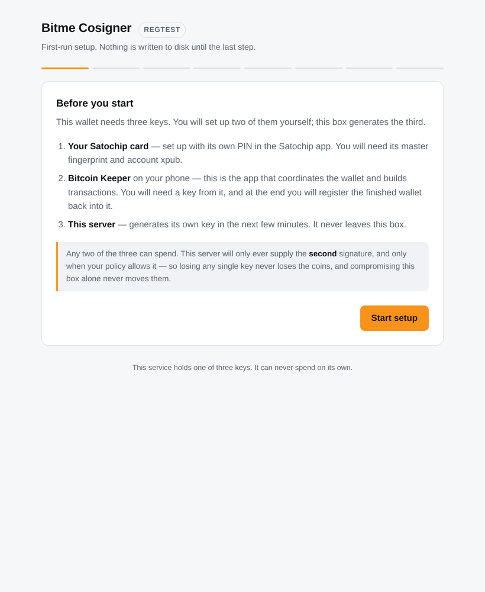
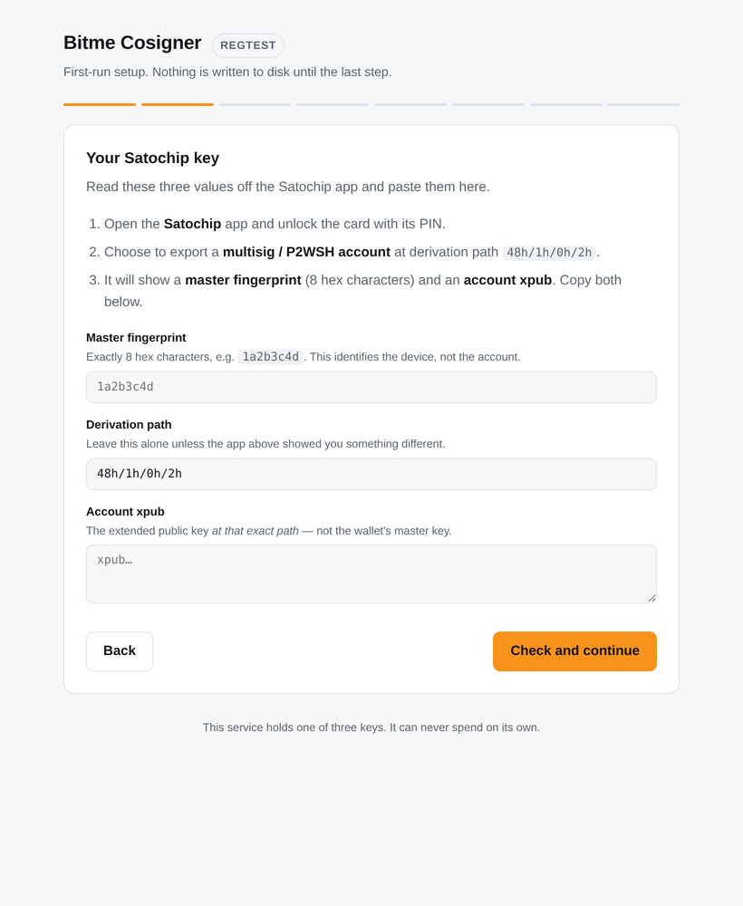
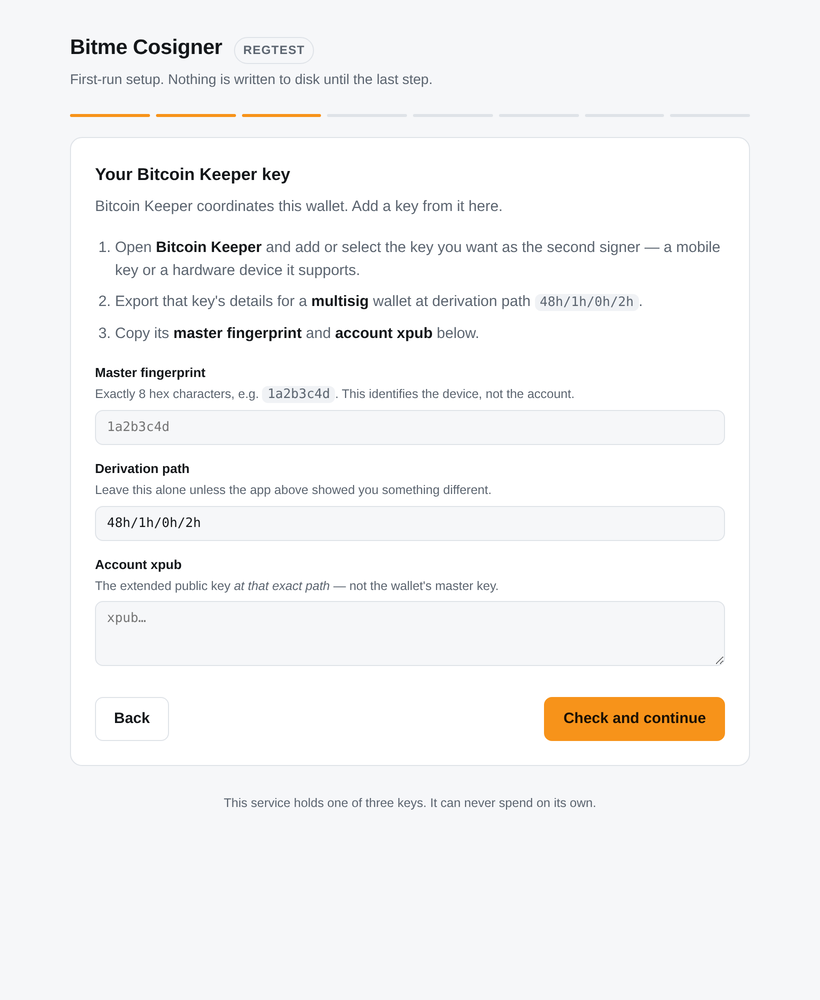
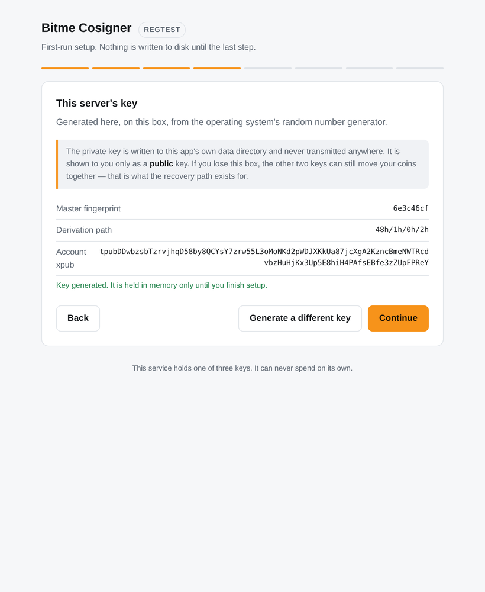
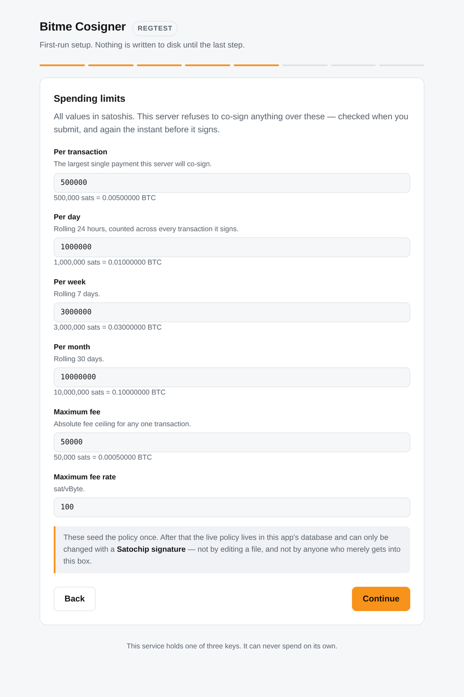
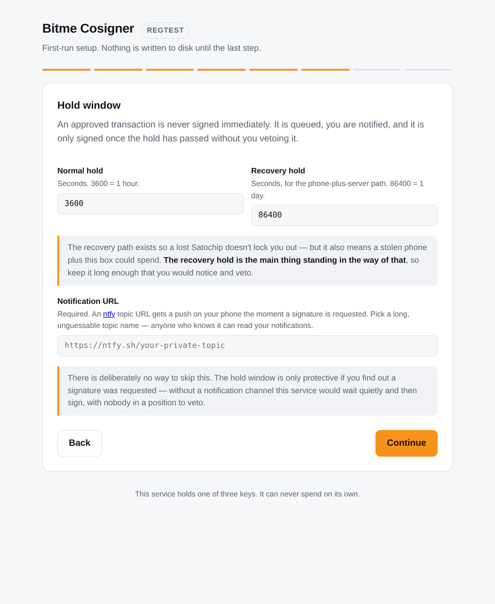
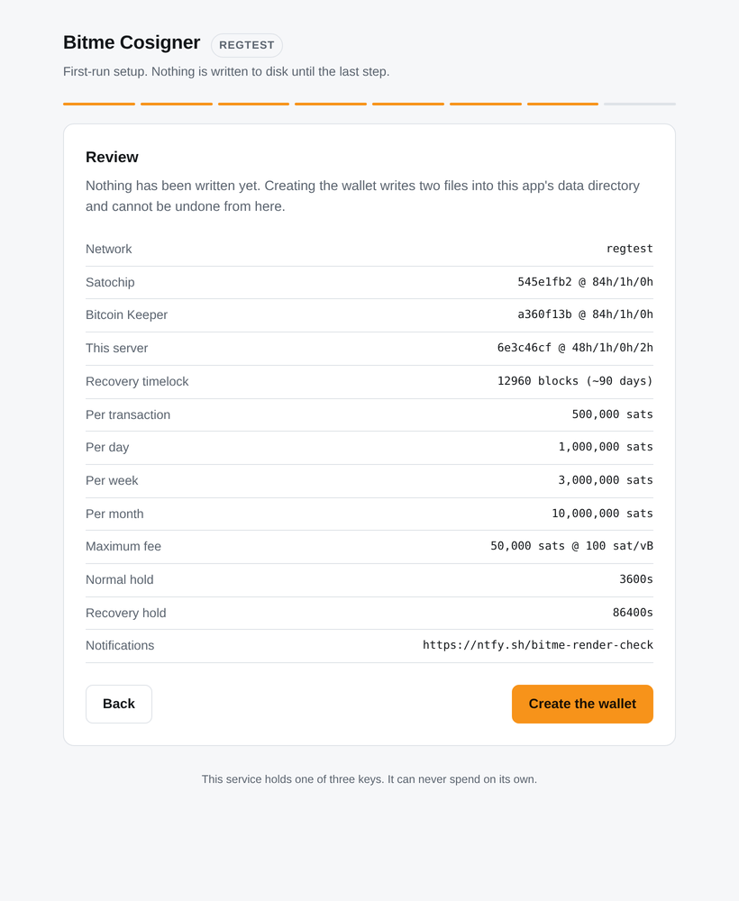
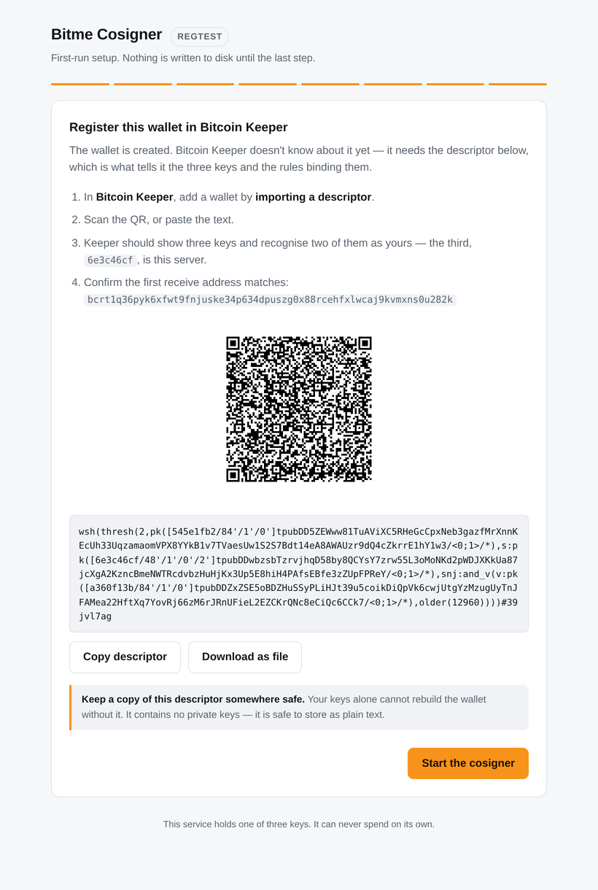

# Setup wizard screenshots

What the first-run wizard actually looks like, captured against a throwaway container running the
real thing — not mockups.

| | |
|---|---|
|  |  |
|  |  |
|  |  |
|  |  |

> **These images are behind the docs.** The wizard still labels the two external keys
> "SATOCHIP" and "Bitcoin Keeper", because that's what the code says today — the HARDWARE and
> MOBILE roles are described generically everywhere else, but the rename hasn't reached the UI.
> The filenames are stuck too: `umbrel-app.yml` points its app-store gallery at these exact
> URLs, so renaming them breaks the store listing. Both get fixed together when the
> [compatibility check](../COMPATIBILITY.md) lands and these are recaptured.

## About the keys visible in these images

Every key and address here is **regtest** — note the `REGTEST` badge, the `tpub…` prefixes, and
the `bcrt1q…` address. They control nothing, on any real network.

- The HARDWARE and MOBILE keys are throwaway test keys, generated for the regtest integration
  suite.
- The SERVER key was generated by the wizard itself during the capture, inside a container that
  was destroyed afterwards.

None of them relate to any real wallet, and nothing here is reusable: each install generates its
own SERVER key from fresh kernel entropy, and the wallet's identity depends on two more xpubs
that come off your own devices. See [`../KEY-GENERATION.md`](../KEY-GENERATION.md).

## Regenerating these

⚠️ **There is no capture script in this repo.** An earlier version of this file described one as
though there were; there never has been. Regenerating these means doing it by hand: point a
container at a regtest node, walk the wizard, and screenshot each step.

What *does* exist is
[`bitme-cosigner/tests/wizard_smoke.mjs`](../../bitme-cosigner/tests/wizard_smoke.mjs), which
drives the whole wizard under jsdom with the API stubbed and asserts behaviour — the
compatibility gate blocking and releasing, validation firing, and the submitted config matching
what was entered. It runs in CI, and covers what the missing script was claimed to cover, minus
the images:

```sh
cd bitme-cosigner && npm install --no-save jsdom && node --test tests/wizard_smoke.mjs
```
